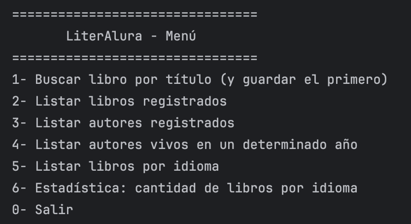
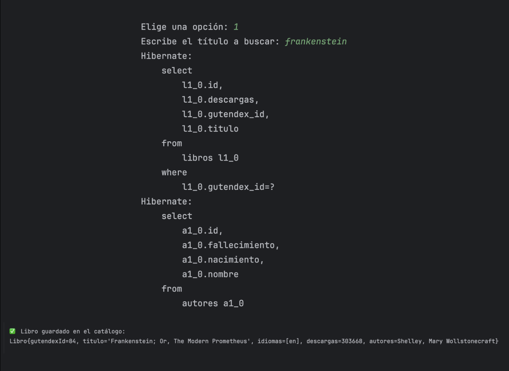
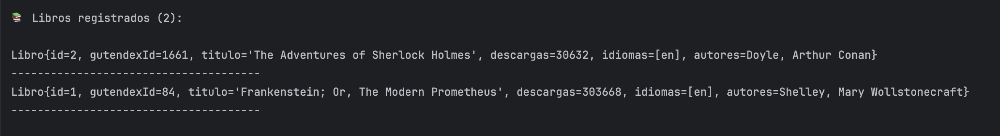
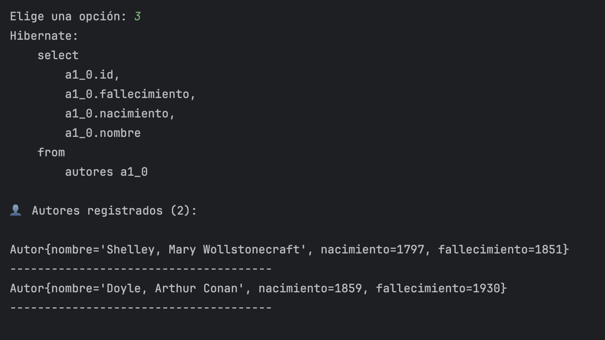
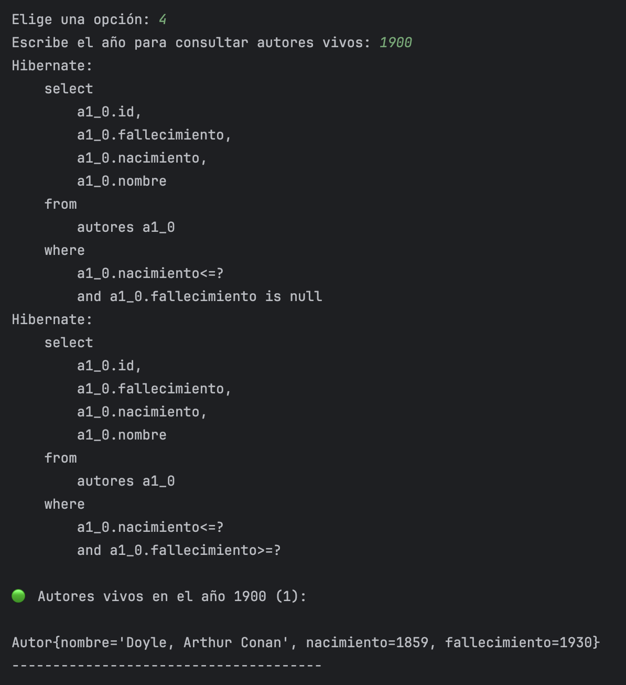
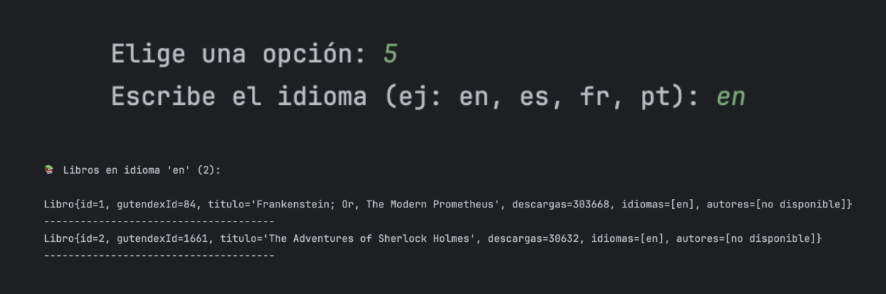
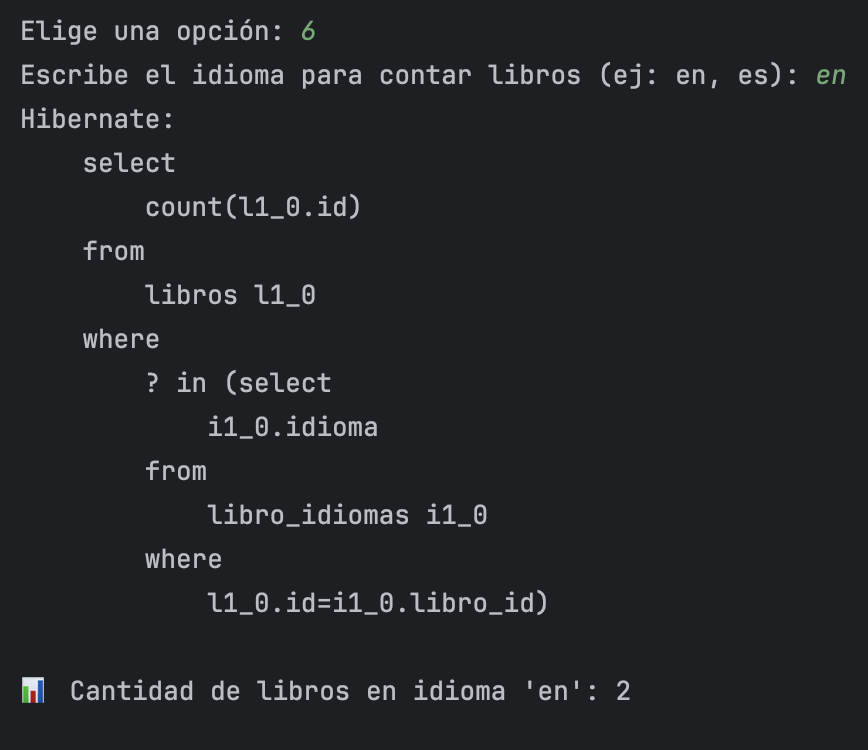
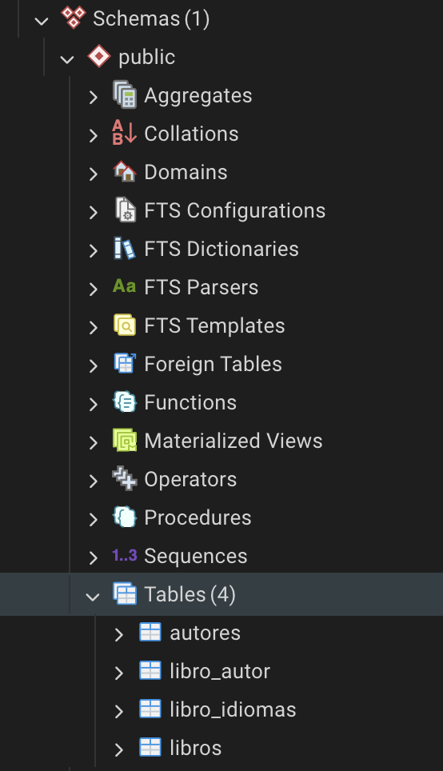
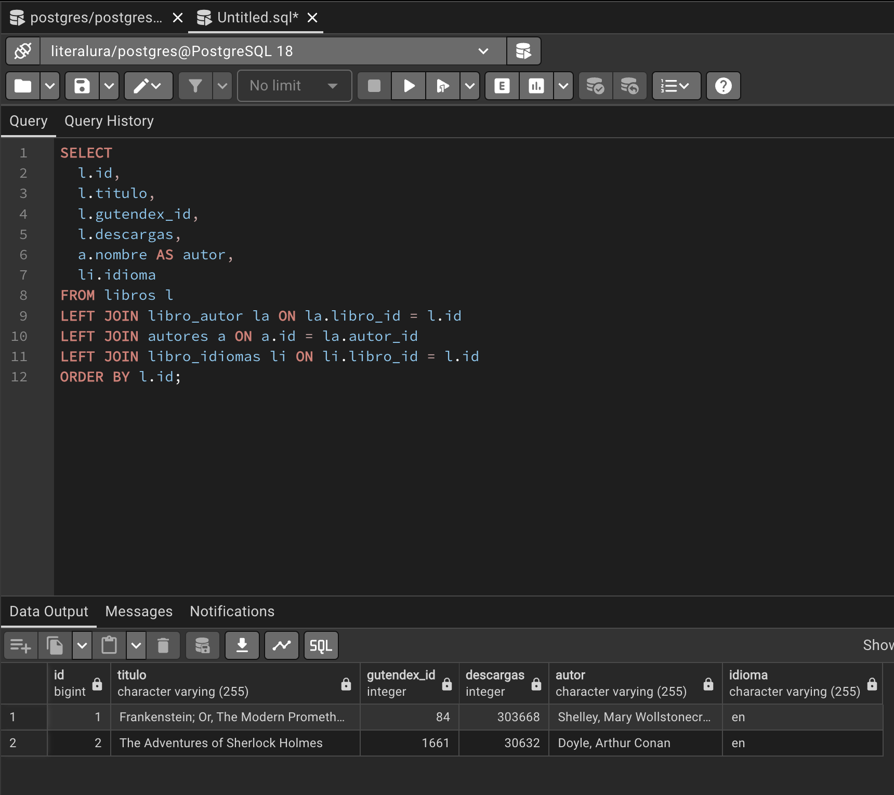

# LiterAlura – Catálogo de Libros (Java + Spring + JPA)

> Desafío Alura (ONE): construye tu propio catálogo de libros consumiendo la API pública **Gutendex**. Guarda los datos en BD y ofrece consultas por consola.

---

## Funcionalidades 

### Libros
1. Buscar libro por título (**consume API y guarda solo el primer resultado**).
2. Listar libros registrados.
3. Listar libros por idioma (ej: `es`, `en`, `fr`).
4. **Exhibir estadística:** cantidad de libros en un determinado idioma (**mínimo 2 idiomas**).

### Autores
5. Listar autores registrados.
6. Listar autores vivos en un año dado (**derived queries**).

**Notas del Challenge implementadas**
- Se guarda **solo el primer autor** del libro (null-safe).
- Se guarda **solo el primer idioma** del libro (null-safe).

---

## Stack
- Java 17, Spring Boot 3, Spring Data JPA
- BD: **PostgreSQL** (H2 opcional en dev)
- Cliente HTTP: `RestClient` (Spring 6+)
- API: `https://gutendex.com/books/?search=<texto>`

---

## Evidencias 

### 1) Menú en consola


### 2) Opción 1: búsqueda y guardado (ej: “frankenstein”)


### 3) Opción 2: listar libros (mostrar que aparece el libro guardado)


### 4) Opción 3: listar autores (mostrar autor guardado)


### 5) Opción 4: autores vivos en un año (ej: 1900) + validación entrada inválida


### 6) Opción 5: listar libros por idioma (ej: en / es)


### 7) Estadística: cantidad de libros por idioma (mínimo 2 idiomas)


### 8) Evidencia en pgAdmin: tablas creadas y datos insertados
- Tablas (autores, libros, libro_autor, libro_idiomas)


- (Consulta SELECT mostrando datos reales en BD


---

## ⚙️ Requisitos
- Java 17+
- Maven 3.9+
- PostgreSQL 14+ (o H2)

---

## 🗃️ Configuración de Base de Datos (PostgreSQL)

### 1) Crear base de datos
En pgAdmin o consola:

```sql
CREATE DATABASE literalura;

### 2) Crear usuario y permisos (recomendado)

```sql
CREATE USER literalura_user WITH PASSWORD 'literalura123';
GRANT ALL PRIVILEGES ON DATABASE literalura TO literalura_user;

-- Permisos para schema public (útil para Hibernate/JPA)
GRANT USAGE, CREATE ON SCHEMA public TO literalura_user;
GRANT ALL PRIVILEGES ON ALL TABLES IN SCHEMA public TO literalura_user;
GRANT ALL PRIVILEGES ON ALL SEQUENCES IN SCHEMA public TO literalura_user;

## ⚙️ Configuración (PostgreSQL)

```properties
spring.application.name=literalura
spring.main.web-application-type=none

# PostgreSQL
spring.datasource.url=jdbc:postgresql://localhost:5432/literalura
spring.datasource.username=literalura_user
spring.datasource.password=TU_PASSWORD
spring.datasource.driver-class-name=org.postgresql.Driver

# JPA / Hibernate
spring.jpa.hibernate.ddl-auto=update
spring.jpa.show-sql=true
spring.jpa.properties.hibernate.dialect=org.hibernate.dialect.PostgreSQLDialect

## 🚀 Cómo correr

1. Configura la BD (PostgreSQL) en `src/main/resources/application.properties`.
2. Ejecuta el proyecto:

```bash
mvn spring-boot:run

3. En consola verás el menú. Prueba el flujo mínimo:

- Opción 1: buscar y guardar un libro (ej: `frankenstein`)
- Opción 2: listar libros
- Opción 3: listar autores
- Opción 4: autores vivos en un año (ej: `1900`)
- Opción 5: listar libros por idioma (ej: `en`, `es`)
- Opción 6 (si aplica): estadística de cantidad de libros por idioma (mínimo 2)
